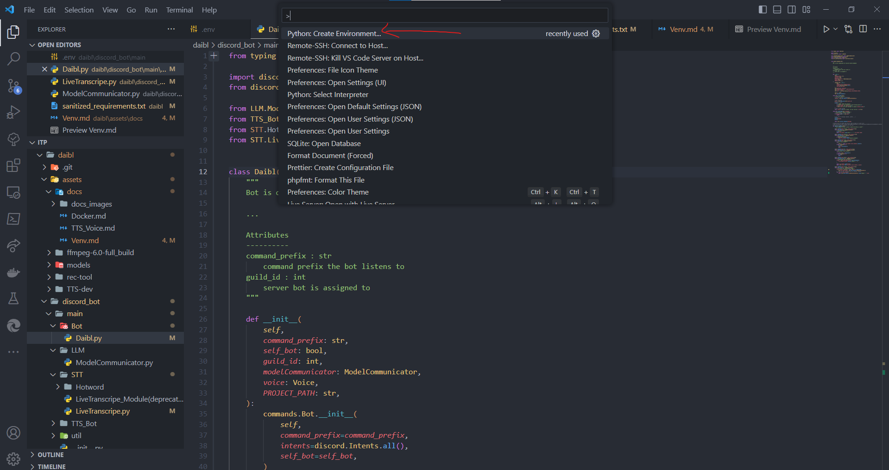
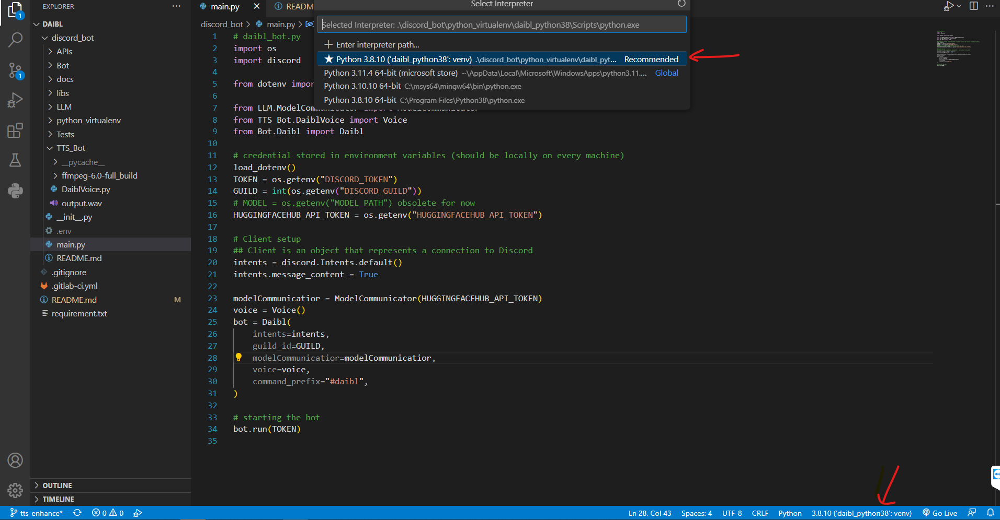

# Steps to get a virtual environment running in VS Code with python

---

**_Loading the requirements.txt over pip install -r requirements.txt after creating the .venv is recommended!_**

1. Step: [Install Python](https://www.python.org/downloads/)

2. Step: [Create virtual environment with or without requirements.txt (vscode)](https://code.visualstudio.com/docs/python/environments)

   From requirements.txt:
   

   Without requirements.txt: (Keyboard-Shortcut: Control+Shift+P)
   

3. Step: Select a python version or enter a path to a python version for the virtual environment: **python interpreter** (vscode)

   

4. Step: Update pip (optional: if you have problems with the packages create an empty .venv and run this command before installing the requirements)

   In the terminal:

   ```sh
   pip install pip setuptools wheel --upgrade
   ```

5. Step **Important**: [Before pushing to repository, update the requirements.txt (only if new packages are used in the project)](https://pip.pypa.io/en/stable/cli/pip_freeze/)

   **Only use pip freeze if you don`t know what packages are needed. Else add it manually to keep the requirements clean and readable**

   Remember pip freeze writes all packages installed in .venv to the requirements.txt . If you want to keep the requirements.txt more compact/sanitized then list only the necessary packages. Dependencies will normally be resolved by pip (another reason to keep pip updated).

   In the terminal:

   ```sh
   pip list # lists all packages
   pip freeze > requirements.txt
   # alternative: python -m pip freeze > requirements.txt
   ```

<br/>

On Windows: **If you get an error try this first**: (Error is related to the [ExecutionPolicy](https://stackoverflow.com/questions/18713086/virtualenv-wont-activate-on-windows))

Open Powershell.exe as Admin and enter:

```sh
Set-ExecutionPolicy Unrestricted -Force
```

This overwrites the type of execution of scripts

## Deactivation and revert changes

```sh
# Before Reverting the ExecutionPolicy deactivate the virtual environment in the terminal
deactivate # deactivates virtual environment

Set-ExecutionPolicy Restricted -Force

Get-ExecutionPolicy # Check if Restricted is set back as default
```

To check if the virtual environment is active:

```sh
python --version
# example output: Python 3.9.10
```

### Install get package/dependencies in virtual env

```sh
pip install -r requirements.txt
```

## CLI-way

Install a python version like in step 1. Pick one of the options below to create your virtual env

```sh
python -m venv my-venv # Creates virtual env with the name my-venv. Version of venv will depend on system python version

python3.9 -m venv my-venv # Creates venv with python version 3.9 named my-venv
# alternative
py -3.9 -m venv /path/to/wherever/you/want/it # example: py -3.9 -m venv my_folder/my-venv

source my-venv/bin/activate # activates the venv
deactivate # to deactivate venv
```

Readings: [Virtual env in jupyter](https://janakiev.com/blog/jupyter-virtual-envs/), [Create venv with different versions](https://stackoverflow.com/questions/70422866/how-to-create-a-venv-with-a-different-python-version)
